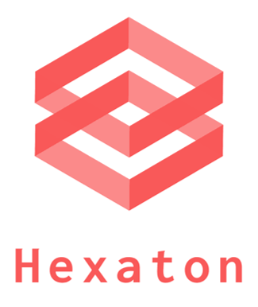
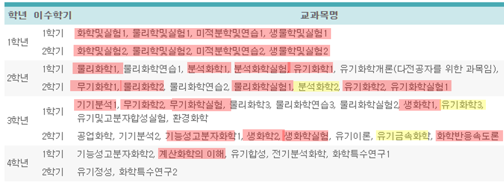
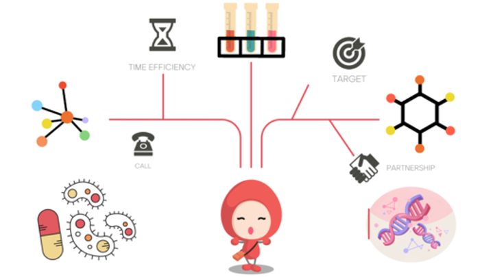
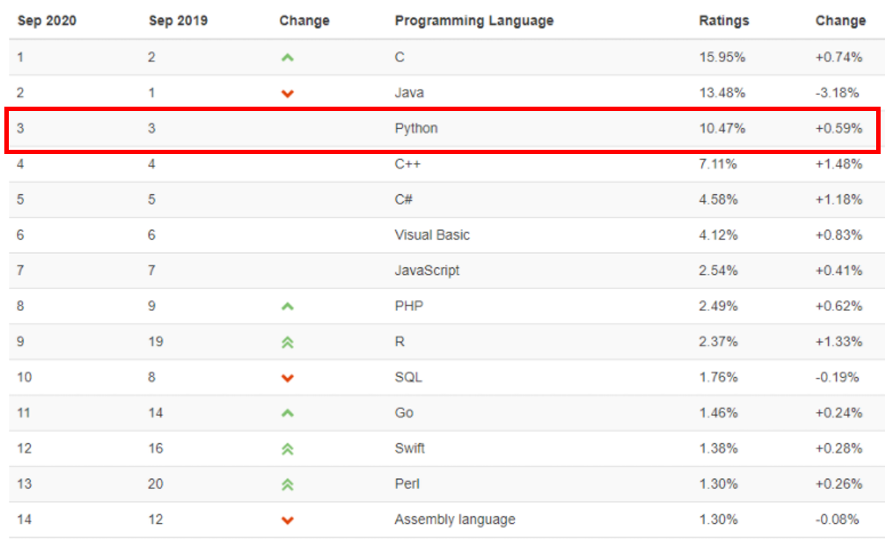
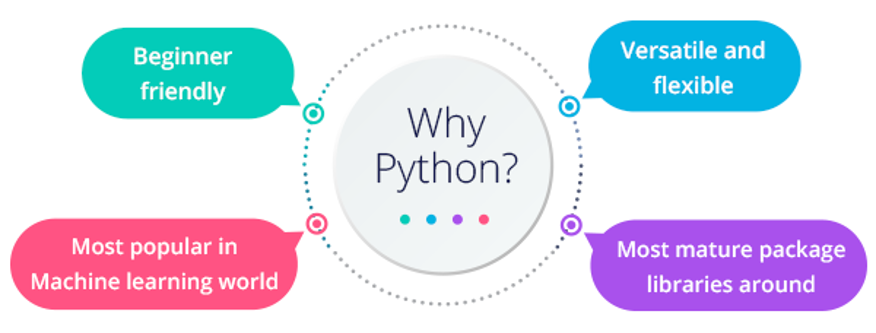
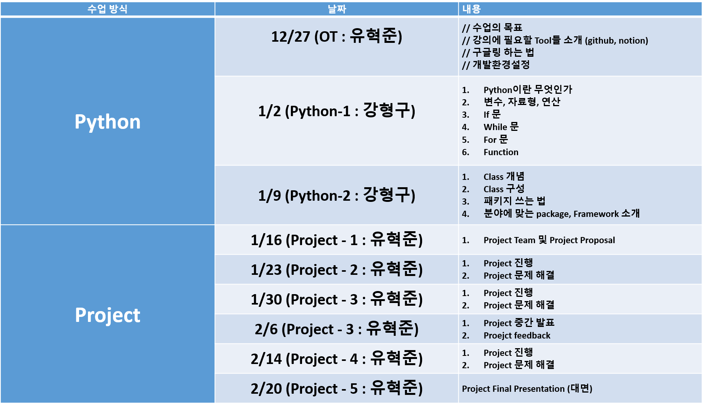
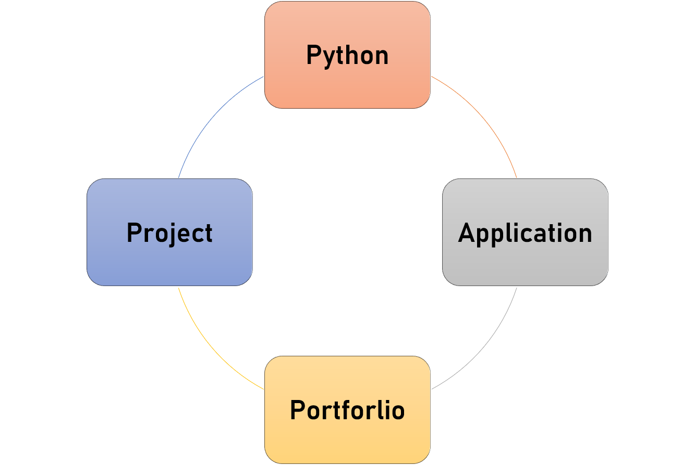

# HexatonClass

여러분 안녕하세요!! Hexaton Class에 오신 것을 환영합니다🙂

## Introduction

요즘 소프트웨어 개발이 굉장히 중요한 이슈로 뜨면서, 코딩이라는 단어를 모두 들어봤을 것이고, 실제로 수업도 들어보신 분도 있으리라 생각합니다. 하지만 정작 코딩이 뭔지, 프로그래밍이 뭔지, Python 이 뭔지 정확히 모르는 경우가 태반입니다. 사회는 점점 소프트웨어 경력을 반 강조하는 분위기로 바뀌고, 이런 분위기에 살고 있는 응용화학과 학부생들에게 나는 이런 질문을 던지고 싶습니다.

> *과연 응용화학과 (Applied Chemistry)인 우리가 정말 응용(Applied)을 하고 있는가?*

실제로 많은 졸업생들은 그런 기회를 많이 접하지 못 했습니다. 저 또한 그러하였고요.

_**심지어 서울캠퍼스 화학과와 커리큘럼 또한 거의 동일하다는 사실은 응용화학과 학부생이라면 모두 다 극명하게 알고 있을 것입니다.**_ 

실제로 서울캠퍼스 화학과의 커리큘럼과 응용화학과의 커리큘럼을 비교해보았을 때, **빨간색 밑줄**은 과목명 마저 똑같은 수업, **노란색 밑줄** 은 과목명은 다르지만 배우는 내용이 비슷한 경우를 체크해보았습니다. 

**과연 무엇이 다를까요?** 

이러한 물음에 저도 스스로 답하지 못한 상황에서, 응용화학과로서의 정체성이 사라지기 직전, 우연히 **"Python”** 이라는 프로그래밍 언어를 접하였습니다.

저는 Python을 공부하면서, ***저의 정체성, 기본 background인 화학을 과연 다른 학문과 접목한다면, 어떤 시너지 효과를 낼 수 있을까?*** 에 대해서 깊은 고민을 하였었고, 이런 강의를 만들게 되었습니다.

## 강의의 목적

제가 하면서 가장 어려웠던 점은 정말 여러가지가 있었습니다.

1. **변수를 어떻게 지정해야 협업할 때 좋을까**
2. **Class는 도대체 어떻게 짜야 협업이나 내가 나중에 재사용할 때 좋을까?**

정말 python을 쓰면서 꿀팁, 공부하는 방법을 알려주는 사람이 없어 굉장히 힘들었고, 아직 과학 분야에서 computer science를 활용한 지 얼마 되지 않아, **도대체 내가 어떻게 적용을 해야할까** 라는 부분에 굉장히 고민이 많았습니다.

그리고 ***Python을 배우면서 도대체 어떻게 써야할까?*** 에 대한 궁금증이 항상 발목을 잡고 있었고, 수업을 들어도 화학 관련된 프로젝트를 하기 굉장히 힘들었습니다.

### 이러한 갈증을 누구보다 절실히 알고있었기에, Hexaton 강의를 열게 되었습니다.

## Chemistry + Python?

위처럼 chemistry는 정말 많은 곳에 접목이 가능합니다.

- 제약 (유기화학)
- 촉매 (유기 + 무기 + 물리 + 재료)
- 계산, 양자역학
- 반도체
- 식품
- 그외 기타

정말 다양한 곳에 화학이 쓰이고, 정말 중요한 학문입니다. 그 만큼 다양한 곳에 쓰이기 때문에, 그 댜양한 학문들을 서로 이어주는 역할을 화학이 해내고 있습니다. 

_**그 역할을 우리는 Python이라는 프로그래밍 언어 도구를 이용하여 여러 학문들을 결합하고 응용하여 새로운 가치를 이번 수업을 통해 도출할 것입니다.**_

## 왜 Python일까?

**우선 python은 2020년 9월 기준으로 개발자들 사이에서 인기있는 프로그래밍언어 3위로 선정되었습니다.** 그만큼 수요도 많고, 그에 걸맞는 커뮤니티도 활성화 되어있어 Googling, 책을 통해 쉽게 개발을 할 수 있습니다.

그리고, Python은 위의 그림처럼 4가지의 장점을 가지고 있습니다.

1. Beginner Friendly
2. Versatile and Flexible
3. Most Popular in Machine Learning World
4. Most Mature Package Libraries around

**따라서 Python을 배운다면, 정말 빠른 시간안에, 다양한 곳에 적용이 가능하기에 Python을 선정하게 되었습니다.**

## 누가 들어야 할까?

1. **이미 Python을 알지만, 어떻게 써야할지 모르는 사람.**
2. **Python으로 다른 사람들과 프로젝트를 해보고 싶은 사람.**
3. **화학에 Python을 접목 시켜보고 싶은 사람**
4. **방학 8주동안 코딩에 미쳐서 살 사람**
5. **하드트레이닝인만큼 힘들어도 버틸 사람**

## 수업 방식

## 무엇을 얻어갈 것인가?

1. Python coding 실력
2. 혼자서 Project를 설계하고 만들어내는 능력
3. 수업을 들으며 개인 Portforlio 작성하는 방법
4. 어디든 적용할 수 있는 Application 능력